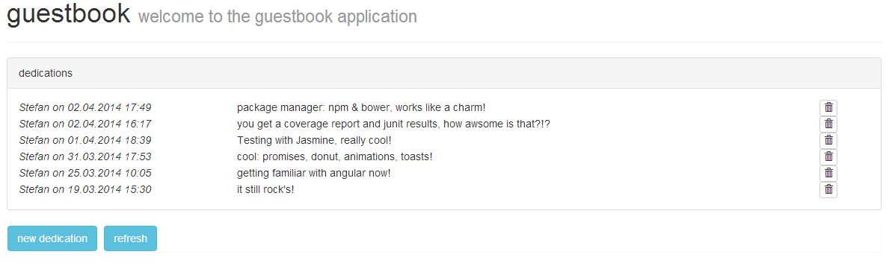
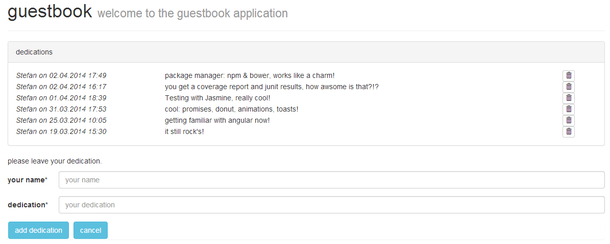

#guestbook - MEAN

This simple guestbook is a showcase for an single page application (SPA) using the MEAN stack.

__M__ ongoDB  
__E__ xpress Framework  
__A__ ngularJS  
__N__ odeJS  

##setup
###node
After downloading the project you need to setup the required dependencies. The setup is based on [npm](https://www.npmjs.org/) for the backend- and [bower](https://github.com/bower/bower) for the frontend dependencies. As bower itself is a node package, you need to install [node](http://nodejs.org/) (respectively npm) first. Please refer to this projects _package.json_ file for the required node version.  
After installing node, you should be abled to call ``npm help`` in a shell. It should list all options available for npm.  
###bower
OK, now it's time to install bower by typing ``npm -g install bower``. The ``-g`` results in installing bower _globally_*. Check it by typing ``bower --version`` in a shell. It should present the bower version installed.
###grunt
To execute the tests (ui & server) we will use [grunt](http://gruntjs.com/). To install the commandline interface of grunt type ``npm -g install grunt-cli``. Again, the ``-g`` results in installing grunt _globally_*. Check the installation by typing ``grunt --version`` in a shell. It should present the grunt version installed.
### mongoDB
The other thing to install is [mongoDB](https://www.mongodb.org/). Just download and install it to whatever location you like. Make sure it is available on the path, so typing ``mongod --version`` in a shell should show you the version installed.
###dependencies
In order to successfully launch the guestbook showcase, you are required to download the dependencies now. Sounds an awful lot of work, but it isn't. You're just two shell commands away from glory.  
First switch to the guestbook showcase root folder.
``npm install`` will examine the _package.json_ file and install all backend dependencies to the _node_modules_ subfolder.
``bower install`` will install all frontend dependencies listed in the _bower.json_ file to the subfolder _public/bower_components_.
That's it...

*The package will be put to your personal folder instead of the node installation folder. If you prefer installing it _locally_ to your node installation folder, switch to _\{NODE_HOME\}/node_modules_ and type ``npm install bower``.  Make sure though, that the _\{NODE_HOME\}/node_modules.bin_ folder is on the path.

##launch
You are now abled to run the guestbook showcase. npm supports defining commands for custom scripts pretty well. These commands are configured in the _package.json_ file.  
Here is the list of commands available for the guestbook showcase.

+  ``npm run db_setup`` creates a subfolder _mongoDB_ which hosts the data/configuration of mongoDB. This only has to be called once.
+  ``npm run db`` launches the mongoDB (blocking call)
+  ``npm run server`` will launch the guestbook HTTP server on port 3000. (blocking call)
+  ``npm run guestbook`` will open the guestbook web page in the browser (windows only, sorry for that...).

## launch with docker
You might alternatively run the guestbook application with docker. The guestbook comes with two docker containers.
### mongodb container
The mongodb container contains the MongoDB. Execute ``docker build -t <your-username>/centos-mongodb .`` in the subfolder docker-mongoDB to build the container and run it by executing ``docker run -itd -p 27017:27017 --name mongodb <your-username>/centos-mongodb``.
### guestbook container
The guestbook container contains the application. Execute ``docker build -t <your-username>/centos-guestbook .`` in the root folder to build the container and run it by executing ``docker run -itd -p 3000:3000 --link mongodb:mongodb --name guestbook <your-username>/centos-guestbook``. As you can see, the guestbook container is linked to the mongodb conatiner in order to be abled to access the database.

##tests 
The showcase comes with both UI and server side unit tests. These tests can either be run directly or repeatingly in the background on file change.
Here is the list of grunt tasks available

+  ``grunt testServer`` runs the [mocha](http://visionmedia.github.io/mocha/) tests for the node application. It uses [chai](http://chaijs.com/) for the assert statements and [sinon](http://sinonjs.org/) for stubbing. The run will provide an [xunit](http://xunitjs.codeplex.com/) report and a [jscoverage coverage report](http://siliconforks.com/jscoverage).
+  ``grunt testServer_background`` starts a watcher on the server side source files as well as on the tests and executes the tests on change. (blocking call)
+  ``grunt testUI`` runs the [jasmine](http://jasmine.github.io/) UI tests with [karma](http://karma-runner.github.io/0.12/index.html). The run will provide an [karma junit report](https://github.com/karma-runner/karma-junit-reporter) and a [karma coverage report](https://github.com/karma-runner/karma-coverage).
+  ``grunt testUI_background`` starts a watcher on the UI source files as well as on the UI tests and executes the UI tests on change. (blocking call)

##overview
As already mentioned, the guestbook showcase is a pretty simple application.
### guestbook
It provides a list of yet added dedications.  

  
### new dedications
When clicking _add dedication_, the lower part provides a form for details of a new dedication.  

